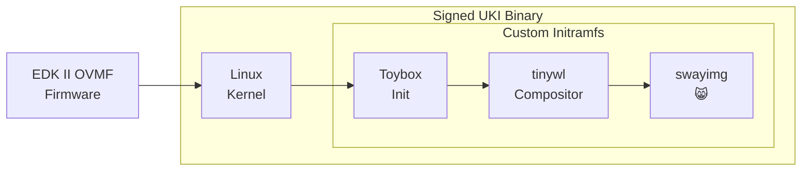

# NekOS


An OS that only displays pictures of my cats.

It's fully Secure Boot signed with a custom keychain, and packed into a single [Unified Kernel Image](https://wiki.archlinux.org/title/Unified_kernel_image).

## Demo
[Video Demo](https://github.com/user-attachments/assets/6ddb556b-715a-49c7-aeaa-9b11f98f9e4b)

## Wait, what?
This is a research and development Linux distribution that I put together with the aim of learning more about the interaction between firmware, kernel, and low-level boot processes. To do this, it's helpful to have a "minimum viable product" distribution that I can control every aspect of. And why not make it do something at least vaguely interesting in the process?

I'm hoping to use this to research Verified Boot, Confidential Compute, and "Bring Your Own Firmware" type setups for physical-access threat models.

### Key Features
* Pictures of my cats!

### Other Features
* EDK II OVMF firmware for QEMU built from source
  * Built with support for [paravirtualised UEFI variables](https://www.qemu.org/docs/master/devel/uefi-vars.html#host-uefi-variable-service)
  * Built with Secure Boot support
* Multiple pre-populated UEFI variable stores:
  * Blank, with Secure Boot disabled
  * Secure Boot enabled and Microsoft keys enrolled
  * Secure Boot enabled and custom keys enrolled
* Linux kernel built from source
* Custom userland based on Toybox
* Kernel + userland packed into a Unified Kernel Image (UKI)
* UKI signed with a custom Secure Boot keychain
* Support for running a macOS (Apple Silicon) host, including all the Secure Boot functionality

## Boot Sequence


## Build Instructions
I don't support this as a general tool, but if you want to base your own project on this then all of the code should be fairly easy to understand, as I've tried to comment it where possible.

To build and test this, you need `podman` and `qemu`.

Since this makes use of the QEMU [Host UEFI variable service](https://www.qemu.org/docs/master/devel/uefi-vars.html#host-uefi-variable-service), you will need at least QEMU 10 to make full use of this.

Install dependencies (Fedora):
```sh
sudo dnf install -y podman qemu
```

Install dependencies (macOS):
```sh
brew install podman qemu
```

Build all components:
```sh
./build-all
```

Build kernel, initramfs, and UKI:
```sh
./build-uki
```

To build any of the individual components, enter the directory for that component and run the build script:
```sh
./build.sh
```

## Running Tests
Since this is a R&D project, there's no real "production" deployment for this and all of the main functionality exists in the `tests/` directory.

The tests will launch QEMU with various elements of our OS loaded/enabled.

Current tests:

| Test | Notes |
|---|---|
| kernel | Test only kernel. |
| kernel,serialonly | Test only kernel using only serial output (no VGA). |
| kernel,initramfs | Test kernel and initramfs (not packed into UKI). |
| fw,kernel | Test firmware and kernel. |
| fw,kernel,initramfs | Test firmware, kernel, and initramfs (not packed into UKI). |
| fw,kernel,initramfs,uki | Test firmware, kernel, and initramfs (packed into UKI). |
| fw,kernel,initramfs,uki,sb-fail | Test firmware, kernel, and initramfs (packed into UKI), with Microsoft Secure Boot keychain. It should **fail**. |
| fw,kernel,initramfs,uki,sb-pass | Test firmware, kernel, and initramfs (packed into UKI), with our custom Secure Boot keychain. It should **pass**. |
| fw,kernel,initramfs,uki,sb-pass,virtio | As above, but using a VirtIO GPU rather than the default `stdvga`. |

## Future Plans
* GitHub Actions to automatically build + release a signed UKI + UEFI Vars that people can run and test
* More validation / signing, including PCRs
* Secure Boot validation from inside OS
  * PCR signing validation from inside OS, using vTPM
* Reproducible firmware build with ability to pre-compute SEV hashes, allowing for Confidential Compute in BYOF environments
  * Like how AWS do it for [their EDK II build](https://github.com/aws/uefi), which uses Nix to guarantee reproducibility
* More interesting stuff in the userland
  * Add another layer to the chain with a signed shim & systemd-boot?
* ISO build process, for booting this on real hardware
* And maybe more fun stuff in the userland? Who knows...

## License
Any code in this repo which is capable of being subject to copyright is licensed as per the LICENSE file in the root of this repository. This doesn't include the images of my cats.
