<div align="center">


# NekOS

**An OS that only displays pictures of my cats.**

**Made with 😸 for 💻.**
</div>

## Demo
[Video Demo](https://github.com/user-attachments/assets/6ddb556b-715a-49c7-aeaa-9b11f98f9e4b)

## Wait, what?
This is my Minimum Viable Product Linux distro. It's built as a research project with the goals of being byte-for-byte reproducible, allowing full measured boot, and supporting attestation via AMD SEV-SNP.

### Key Features
* Pictures of my cats!

### Other Features
* EDK II OVMF firmware for QEMU built from source
  * Built with support for [paravirtualised UEFI variables](https://www.qemu.org/docs/master/devel/uefi-vars.html#host-uefi-variable-service)
  * Built with Secure Boot support
* Multiple pre-populated UEFI variable stores:
  * Blank, with Secure Boot disabled
  * Secure Boot enabled and Microsoft keys enrolled
  * Secure Boot enabled and custom keys enrolled
* Linux kernel built from source
* Custom userland based on BusyBox
* Kernel + userland packed into a Unified Kernel Image (UKI)
* UKI signed with a custom Secure Boot keychain
* Support for running on a macOS (Apple Silicon) host, including all the Secure Boot functionality
* Byte-for-byte reproducible (WIP - See [Reproducible Builds](#reproducible-builds) section)

## Boot Sequence (Direct UKI boot)
In the direct-boot flow, the build processes in this repo produce a NekOS UKI, signed for UEFI Secure Boot.

```mermaid
flowchart LR
    fw[EDK II OVMF<br>Firmware] --> kernel
    kernel[NekOS<br>Linux<br>Kernel]
    subgraph Secure-Boot-signed UKI
        subgraph Custom Initramfs
            init[BusyBox<br>Init]
            init --> tinywl[tinywl<br>Compositor]
            tinywl --> swayimg[swayimg<br>😸]
        end
        kernel --> init
    end
```



## Boot Sequence (stboot)
In the stboot flow, the build processes in this repo produce a stboot UKI, which contains a [stboot kernel](https://git.glasklar.is/system-transparency/core/stimages/-/tree/main/contrib/stboot) and public key to validate the next stage of the boot.

The second stage of the stboot flow involves fetching the NekOS ZIP package (similar to a UKI since it's just our NekOS kernel and initramfs) over the network, validating it, and then `kexec`-ing into the NekOS environment.

There are some limitations of this flow - notably that `build-stboot` doesn't seem to support building `aarch64` stboot environments yet, so I'll explore it more in future.

```mermaid
flowchart LR
    fw[EDK II OVMF<br>Firmware] --> sbkern
    subgraph Secure-Boot-signed UKI
        sbkern[stboot<br>Linux<br>Kernel]-->sbinit[stboot<br>Initramfs]
    end
    sbinit --Fetched<br>via<br>HTTPS--> kernel[NekOS<br>Linux<br>Kernel]
    subgraph stboot-signed ZIP
        subgraph Custom Initramfs 
            init[BusyBox<br>Init]
            init --> tinywl[tinywl<br>Compositor]
            tinywl --> swayimg[swayimg<br>😸]
        end
        kernel --> init
    end
```



## Build Instructions
I don't support this as a general tool, but if you want to base your own project on this then all of the code should be fairly easy to understand, as I've tried to comment it where possible.

To build and test this, you need `podman`, and `qemu`.

Since this makes use of the QEMU [Host UEFI variable service](https://www.qemu.org/docs/master/devel/uefi-vars.html#host-uefi-variable-service), you will need at least QEMU 10 to make full use of this.

### Dependencies
Install dependencies (Fedora):
```sh
sudo dnf install -y podman qemu
```

Install dependencies (macOS):
```sh
brew install podman qemu
```

### Build All The Things!
If you haven't built any of the NekOS components before, you will want to build the whole ecosystem.

Run this if you want to build everything:
```sh
./build-all
```

This is also the same command used by the GitHub Actions runners, so that all components are being continually validated.

### Building Selectively
Selective builds are useful for development to avoid full rebuilds if you're working on only a subset of the system.

Build just kernel, initramfs, and direct-booting UKI:
```sh
./build-uki
```

Build just kernel, initramfs, and stboot-booting UKI:
```sh
./build-stboot
```

To build any of the individual components, enter the directory for that component and run the build script:
```sh
./build.sh
```

## Running Tests
Since this is a R&D project, there's no real "production" deployment for this and all of the main functionality exists in the `tests/` directory.

The tests will launch QEMU with various elements of our OS loaded/enabled.

Current tests:

| **Test** | **Notes** |
|---|---|
| kernel | Test only kernel. |
| kernel,serialonly | Test only kernel using only serial output (no VGA). |
| kernel,initramfs | Test kernel and initramfs (not packed into UKI). |
| fw,kernel | Test firmware and kernel. |
| fw,kernel,initramfs | Test firmware, kernel, and initramfs (not packed into UKI). |
| fw,kernel,initramfs,stboot | Test OS image booted via stboot UKI. |
| fw,kernel,initramfs,stboot,sb-pass | Test OS image booted via stboot UKI, with our custom Secure Boot keychain. It should **pass**. |
| fw,kernel,initramfs,uki | Test firmware, kernel, and initramfs (packed into UKI). |
| fw,kernel,initramfs,uki,sb-fail | Test firmware, kernel, and initramfs (packed into UKI), with Microsoft Secure Boot keychain. It should **fail**. |
| fw,kernel,initramfs,uki,sb-pass | Test firmware, kernel, and initramfs (packed into UKI), with our custom Secure Boot keychain. It should **pass**. |
| fw,kernel,initramfs,uki,sb-pass,virtio | As above, but using a VirtIO GPU rather than the default `stdvga`. |
| microvm,kernel,initramfs,serialonly | Run the kernel & initramfs as a MicroVM. We only expect text output here. |

## Reproducible Builds
NekOS is built with the goal of being byte-for-byte reproducible. This is a long-term work in progress, tracked [on this project board](https://github.com/users/alexhaydock/projects/1/views/1).

| **Component** | **Reproducible?** | **Method** | **Notes** |
|---|---|---|---|
| Firmware | ✅ | Nix build inside Podman, inspired by [aws/uefi](https://github.com/aws/uefi). | Only reproducible on x86_64 at the moment, but not a huge issue since SEV-SNP is an x86-only feature. |
| Kernel | ✅ | Nix build inside Podman. See [kernel docs on reproducible builds](https://www.kernel.org/doc/html/v6.18/kbuild/reproducible-builds.html). | Reproducible, but I think there's still some Nix build paths leaking into the kernel image as _any_ change to the `default.nix` no matter how irrelevant leads to a different kernel hash. |
| Userland | ❌ |  | This will depend heavily on whether `tinywl` can be built reproducibly. |
| NekOS UKI | ❌ |  | Reproducibility will need to be considered _before_ signing the UKI for UEFI Secure Boot. |
| stboot UKI | ❌ |  | Not investigated yet. |
| stboot OS ZIP | ❌ |  | Not investigated yet. |

## Component Versions
As part of the effort to ensure reproducibility, the upstream components and build environments used to produce NekOS are pinned.

For more info, see [VERSIONS.md](VERSIONS.md) in the root of this repo.

## Future Plans
* Consider signing UKIs for Secure Boot using a YubiKey as a HSM:
  * https://docs.system-transparency.org/st-1.3.0/docs/how-to/secure-boot/sign-efi-applications/yubikey/
* Reproducible firmware build with ability to pre-compute SEV hashes, allowing for Confidential Compute in BYOF environments
  * Add the SEV-SNP measurements into the build process using [sev-snp-measure](https://github.com/virtee/sev-snp-measure) or something similar.
  * I want to add in `snpguest` to validate AMD SEV-SNP from inside the OS, and compare it to the firmware build above.
* Add more cats!

## License
Any code in this repo which is capable of being subject to copyright is licensed as per the LICENSE file in the root of this repository. This doesn't include the images of my cats. This also does not include the code for the EDK2 firmware build, which is based on [aws/uefi](https://github.com/aws/uefi) and inherits the BSD-2-Clause-Patent license used by AWS.
